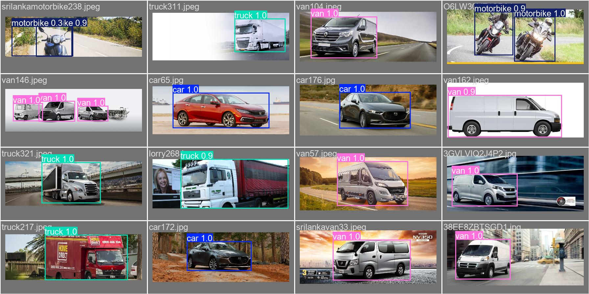

# GAN-CNN: From Data Curation to Stylized Detections

`car_classification_cnn.ipynb` consolidates the four ITS Learning milestones into a single, reproducible workflow: dataset curation, CNN diagnosis and optimization, YOLOv5 fine-tuning, and a GAN-inspired stylization stage. The repository demonstrates the complete progression from raw annotations to deployable detectors and stylized composites.

---

## System Snapshot

```
Data (cars vs. other vehicles) ─┐
                                ├─→ Binary CNN (Milestone 2) ─→ best_model.h5
YOLO-formatted labels ──────────┤
                                ├─→ YOLOv5 fine-tuning (Milestone 3) ─→ best.pt / best.mlpackage
                                └─→ PencilSketchGAN stylization (Milestone 4) ─→ results/milestone4
```



---

## Repository Tour

| Path | Description |
| --- | --- |
| `car_classification_cnn.ipynb` | Notebook covering Milestones 1–4: data preparation, CNN bias/variance diagnosis, YOLO fine-tuning, GAN stylization. |
| `data/` | Train/valid images + YOLO labels (`class_id x_center y_center width height`). |
| `best_model.h5` | Optimized binary classifier checkpoint (cars vs. everything else). |
| `runs/detect/train_optimized/` | Ultralytics artifacts (curves, metrics, Core ML export, `weights/best.pt`). |
| `results/milestone4/` | Composite images from the PencilSketchGAN pipeline. |
| `data.yaml` | Auto-generated YOLO config pointing to this dataset. |

---

## Milestones & Highlights

### Milestone 1 – Data Preparation
- 2,100 train + 900 validation images spanning seven vehicle classes.
- Every sample carries YOLO TXT annotations; at least 10% of the set intentionally lacks the target car to teach generalization.
- Zippable deliverable: `data/train` and `data/valid` folders already mirror the required submission layout.

### Milestone 2 – CNN Optimization
- Baseline: four Conv blocks, no regularization — exposes 82.7% accuracy but only 41% recall on cars.
- Diagnosis: confusion matrix + metrics identify class imbalance, so we apply class weights (4.96× penalty on car errors), Dropout 0.4, L2=0.01, EarlyStopping, ModelCheckpoint, ReduceLROnPlateau.
- Final metrics: 91.1% accuracy, 88.9% precision, 56.4% recall on cars — all logged in the notebook plus saved checkpoint `best_model.h5`.

### Milestone 3 – YOLO Object Detection
- Ultralytics YOLOv5s fine-tuned with Apple M4 acceleration (`device='mps'`, AMP ON, caching).  
- Best checkpoint: `runs/detect/train_optimized/weights/best.pt` (mAP50-95 = **0.907**).  
- Visual diagnostics: `results.png`, `confusion_matrix.png`, and per-batch predictions (see figure above).

### Milestone 4 – YOLO → PencilSketchGAN
- Detections from Milestone 3 feed into a custom `PencilSketchGAN` (edge emphasis + procedural hatching) to mimic a CycleGAN pencil transfer.
- Stylized patches are pasted back into the original scene, yielding gallery-ready composites (saved under `results/milestone4/` and previewed in the notebook).
- Every run samples new validation images, so `results/milestone4/` quickly fills with unique “pen-and-ink” renderings that complement the quantitative YOLO metrics above.

---

## Quickstart

1. **Environment**
   ```bash
   python -m venv .venv && source .venv/bin/activate
   pip install -r requirements.txt  # tensorflow>=2.15, torch, ultralytics, pillow, etc.
   ```

2. **Notebook Run**  
   Launch Jupyter/Lab, open `car_classification_cnn.ipynb`, and execute cells sequentially to reproduce every milestone (data prep → CNN → YOLO → GAN stylization).

3. **YOLO CLI (optional)**
   ```bash
   yolo detect train data=data.yaml model=yolov5su.pt imgsz=416 epochs=50 batch=16 device=mps name=train_optimized
   ```

4. **Inference Examples**
   ```python
   # Binary classifier
   from tensorflow import keras
   model = keras.models.load_model("best_model.h5")
   prob = model.predict(preprocessed_batch)

   # YOLO detector
   from ultralytics import YOLO
   yolo = YOLO("runs/detect/train_optimized/weights/best.pt")
   yolo("data/valid/images/00110.jpg", save=True)
   ```

---

## Why This Project Stands Out

- **End-to-end traceability** — Each milestone is documented in one notebook with metrics, visualizations, and saved artifacts aligned to the rubric.
- **Apple Silicon readiness** — YOLO training and exports target M-series hardware, including Core ML packaging for on-device deployment.
- **Creative finish** — Milestone 4 extends beyond detection, demonstrating a reusable stylization pipeline that builds on YOLO outputs to produce presentation-quality imagery.

Refer to the notebook for execution order, configuration details, and reproducibility notes.
