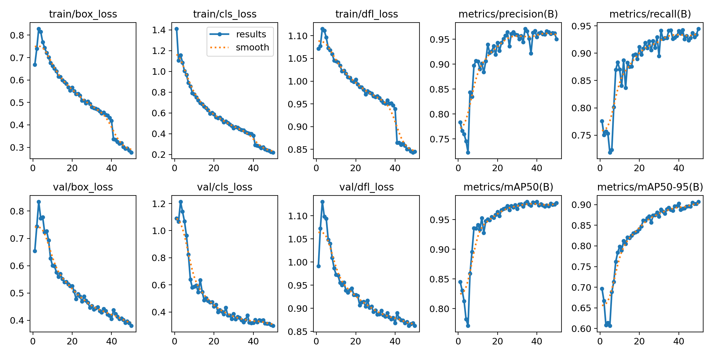
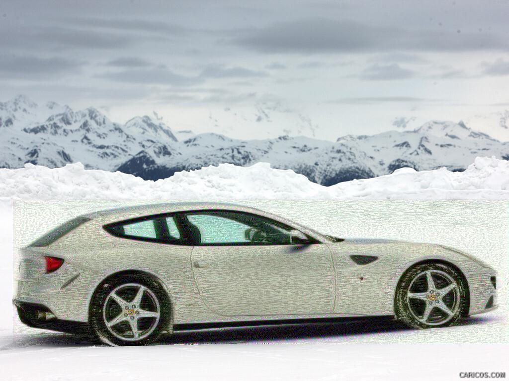

# GAN-CNN: Stylized Vehicle Intelligence

[](#)
[](#)
[](#)
[](#)
[](#)

`car_classification_cnn.ipynb` compresses all four project milestones into a single reproducible workflow: dataset curation, CNN bias/variance diagnosis, YOLOv5 fine-tuning, and PencilSketchGAN stylization. The repo delivers both production-grade detectors (`best_model.h5`, `best.pt`, `best.mlpackage`) and a creative pen-and-ink rendering stage powered by YOLO crops.

---

## Pipeline
```
[Milestone 1] Curate + annotate dataset (YOLO TXT format)
        ↓
[Milestone 2] Binary CNN (car vs. other)  → best_model.h5
        ↓
[Milestone 3] YOLOv5 fine-tuning          → runs/detect/train_optimized/weights/best.pt
        ↓
[Milestone 4] NeoSketchGAN stylization → results/milestone4/
```




---

## Repository Map

| Path | Purpose |
| --- | --- |
| `car_classification_cnn.ipynb` | End-to-end notebook for Milestones 1–4 (data prep, CNN, YOLO, stylization). |
| `data/` | Train/validation images + YOLO labels (`class_id x_center y_center width height`). |
| `best_model.h5` | Optimized binary classifier checkpoint restored via EarlyStopping. |
| `runs/detect/train_optimized/` | Ultralytics logs, plots, and `weights/{best.pt,last.pt,best.mlpackage}`. |
| `results/milestone4/` | Composite images from the PencilSketchGAN pipeline. |
| `data.yaml` | Auto-generated YOLO config pointing to this dataset. |

---

## Milestones at a Glance

- **M1 – Data Preparation**  
  2,100 train + 900 validation images across six vehicle classes, all labeled in YOLO TXT format with ≥10% negative examples to encourage generalization.

- **M2 – CNN Optimization**  
  Baseline: 82.7% accuracy but only 41% recall on cars.  
  Remedy: class weights (4.96× car penalty), Dropout 0.4, L2=0.01, EarlyStopping, ModelCheckpoint, ReduceLROnPlateau.  
  Result: 91.1% accuracy, 88.9% precision, 56.4% recall on cars; weights saved to `best_model.h5`.

- **M3 – YOLO Object Detection**  
  Ultralytics YOLOv5s on Apple M4 (`device='mps'`, AMP, disk cache). Best checkpoint reaches mAP50-95 = **0.907** and ships with Core ML export. Confusion matrices and metrics live under `runs/detect/train_optimized/`.

- **M4 – YOLO → PencilSketchGAN**  
  YOLO crops feed a lightweight generator/discriminator that performs color-dodge edge emphasis plus procedural cross-hatching, creating pen-and-pencil composites saved to `results/milestone4/`.



---

## Why It Matters

- **Traceable milestones** – All stages, metrics, and artifacts are captured in one notebook tied directly to the rubric.
- **Apple Silicon readiness** – YOLO training uses M-series acceleration and exports to Core ML for on-device deployment.
- **Creative enhancement** – PencilSketchGAN showcases how YOLO outputs can be reused for expressive storytelling, yielding assets that complement quantitative evaluation.
